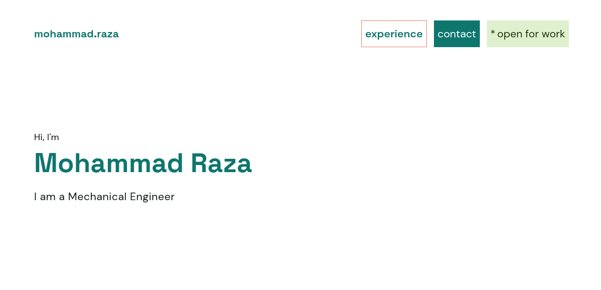

# A Simple Portfolio Site SPA in React

## Introduction

This is a simple portfolio site. This is a React SPA. It uses React Router for routing,
Tanstack Query for server state management. It uses Sanity CMS as backend. The Sanity
schema is not in this repo, but can be figured out from code if required. It
also uses Cloudflare Worker code of which can be found in `worker` directory.

## Code organization

All the javascript code is in src directory. Components are in `components` directory.
Fragments are the UI elements which are made of components and has itself been
made into component for code organization purposes and they have been put in
`fragments` directory. Difference between component and fragment is a blurry line,
and it depends on one's taste. Any fragment could as well have been component.
All the backend code which fetches data from the CMS have been put in `lib`
directory.

## Testing

No testing code has been written for this project. It is not supposed to be
anything larger than this is at this point, so I have not put very much
importance on testing.

## Accessibility

I have used necessary HTML semantic elements and ARIA attributes
for accessibility of the site. I tested the accessibility using
Chrome lighthouse. The accessibility was 100, and performance was
around 75. Performance score is not so good. Large Contentful Paint
and some other metric which denotes "time to first paint"
was the main problem for performance score. Which was being caused
by loading of the DM Sans font from Google fonts
and loading of index.css from the app server.
I don't see how index.css can be further improved. For Google
font, they can be downloaded and hosted from the app server itself.
Currently it is loading the italic fonts also and fonts of other sizes
also, may be loading only the necessary fonts would help in performance.
Also for performance I inlined the hero section in the code rather
than fetching it from CMS over network.

## Analytics

The code as it is now, uses Umami analytics. If the environment variable
VITE_UMAMI_WEBSITE_ID is defined, then a script tag will be injected into
the `head` to load the umami script. If not present, it does not add the
umami script loading. Analytics is privacy friendly and collects anonymous
usage data. If the client browser has blocker enabled which blocks the
analytics script loading, a request is made to backend endpoint to mark
that the script was blocked. That backend endpoint is handled by the Cloudflare
Worker. In this way, an estimate can be made of the number of visitors at least.
Although, because the request and analytics is not authenticated, the results
might not be very useful.

## Environment variables

Two environment variables are required. These are for the CMS :-

- VITE_SANITY_PROJECT_ID
- VITE_SANITY_DATASET

Other variable for Umami analytics is optional :-

- VITE_UMAMI_WEBSITE_ID

## Figma design files

Figma design files are in directory `figma`. You won't find any variable "architecture"
in the design file. All the spacing values have been hardcoded. There's primitive
variables for colors but there's no semantic variables. For a project of this size, I didn't
felt the need of such systems. Also I didn't wanted to be bogged down in those details
and not complete the project. Although they might have been a nice thing and certainly
would have helped. There are style variables for typogrpahy. The fonts that
have been used are `Space Grotesk` for headings and `DM Sans` for body.

## Deployment

The app is supposed to be deployed on Cloudflare, that's why there's Worker code.
If you want to deploy somewhere else, I think only the code in `worker` directory
would need replacement by your platform's equivalent, and nothing else would
be required to be changed.

Wranger config file has not been included in the repo. If you want to deploy to
Cloudflare, you will have to provision that yourself or deploy using other ways.

## Further improvements

- All the project list is loaded at once. No pagination is used.
  Though "load more" button is shown if there's more number of
  projects, but full projects list is downloaded from the network.
  Pagination could be used here.

- Library code in `lib` which does the network could be
  made more framework agnostic by making the functions
  network fetching functions and not hooks. Currently
  they are hooks and returns the return value of
  `useQuery` function tanstack query. They could
  be made so that they just make the network request
  and return the results. Then the application code could
  make hooks which uses those functions with `useQuery`
  if they are using tanstack query or something equivalent
  in their library of choice.

- UI design could certainly be made better

## AI usage

AI was not used in any significant way in coding this project.
It was primarily used for debugging when I got stuck and for
searching purposes.
